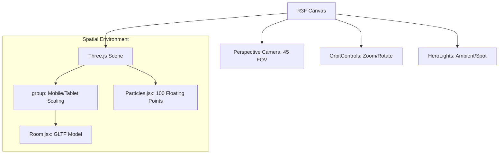
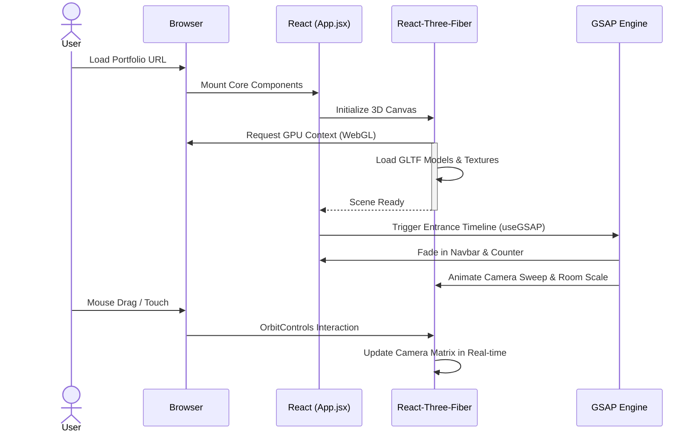

# React + Vite

This template provides a minimal setup to get React working in Vite with HMR and some ESLint rules.

Currently, two official plugins are available:

- [@vitejs/plugin-react](https://github.com/vitejs/vite-plugin-react/blob/main/packages/plugin-react) uses [Babel](https://babeljs.io/) (or [oxc](https://oxc.rs) when used in [rolldown-vite](https://vite.dev/guide/rolldown)) for Fast Refresh
- [@vitejs/plugin-react-swc](https://github.com/vitejs/vite-plugin-react/blob/main/packages/plugin-react-swc) uses [SWC](https://swc.rs/) for Fast Refresh

### 🏗️ Project Architecture Map

```
📁 3D_Portfolio
├── 📁 public               # static assets (GLTF models, textures, images)
├── 📁 src
│   ├── 📁 components       # Reusable React & 3D sub-components
│   ├── 📁 sections         # Main page sections (Hero, Showcase, Contact)
│   ├── 📁 constants        # Configuration and data files
│   ├── 📁 assets           # Stylesheets and global assets
│   ├── 📄 App.jsx          # Main entry and layout orchestrator
│   └── 📄 main.jsx         # React mounting point
├── 📄 index.html           # HTML template
├── 📄 vite.config.js       # Build & Dev performance config
└── 📄 README.md            # Advanced documentation
```

---

## 🎨 3D Scene Hierarchy (Hero Section)

This diagram visualizes how the **React-Three-Fiber** scene is structured for spatial rendering.



---

## 🎬 Interaction & Animation Workflow

The sequence of events from page load to cinematic interactive state:



---

## ✨ Features

## React Compiler

The React Compiler is not enabled on this template because of its impact on dev & build performances. To add it, see [this documentation](https://react.dev/learn/react-compiler/installation).

## Expanding the ESLint configuration

If you are developing a production application, we recommend using TypeScript with type-aware lint rules enabled. Check out the [TS template](https://github.com/vitejs/vite/tree/main/packages/create-vite/template-react-ts) for information on how to integrate TypeScript and [`typescript-eslint`](https://typescript-eslint.io) in your project.
